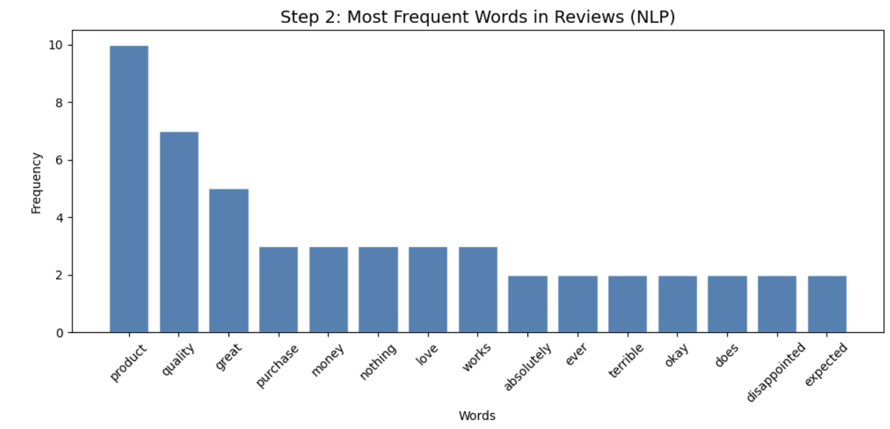
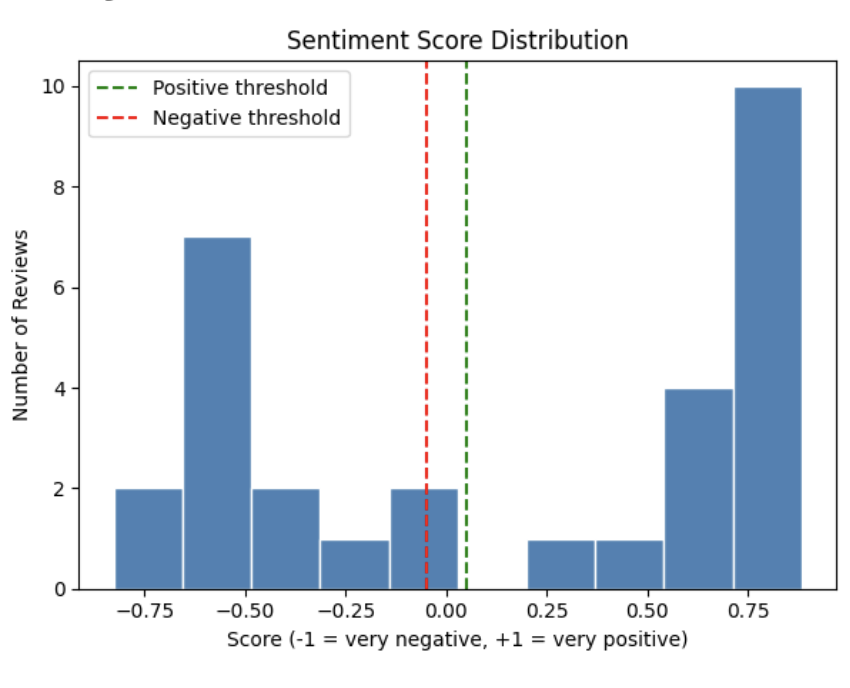

# Amazon Product Reviews — Sentiment Analysis

---

> *Every review is a person trying to be heard.*
> *This project actually listens.*

---

## The Question That Started Everything

Behind every star rating is a feeling.
Behind every complaint is a fixable problem.
Behind every glowing review is a marketing opportunity.

**But who has time to read thousands of reviews one by one?**

This project teaches a machine to do it automatically —
reading the emotion behind every word, classifying it,
and turning raw customer opinions into real business decisions.

---

## What This Is

A full Sentiment Analysis performed on 30 Amazon style product reviews
using Natural Language Processing techniques.

Every review is automatically scored, labelled, and analyzed —
positive, negative, or neutral — and the findings are translated
into five actionable business recommendations.

---

## The Dataset At A Glance

| Column | Type | Description |
|--------|------|-------------|
| ReviewID | Number | Unique review identifier |
| ReviewText | Text | Raw customer review |
| SentimentScore | Number | Score from -1 to +1 |
| Sentiment | Text | Positive, Negative or Neutral |

30 reviews. Real customer language.
Praise, frustration, and everything in between.

---

## The Five Questions I Asked First

Before writing code, I wrote these down:

1. What percentage of customers are happy with this product?
2. What words appear most across all reviews?
3. Is there a pattern in what unhappy customers complain about?
4. Can we automatically detect emotion without reading manually?
5. What should the business do differently based on these reviews?

Every chart and every line of code in this notebook
exists to answer one of these questions.

---

## What I Found

**Most customers are satisfied**
16 out of 30 reviews were classified as positive —
the largest group by a clear margin.

**Negative reviews are significant too**
12 out of 30 reviews were negative — a number too large to ignore.
The word "terrible" and "disappointed" appeared repeatedly,
pointing to a consistent product quality issue.

**The word data tells a story**
The most used word across all reviews was "product" — followed by
"quality" and "great". Customers care deeply about what they
are getting for their money.

**Neutral customers are a small but winnable group**
Only 2 reviews were neutral — these customers are on the fence
and the easiest to convert with small improvements.

**The scores do not lie**
The sentiment score distribution shows two clear peaks —
one around -0.5 for frustrated customers and one around +0.75
for happy ones. Very few reviews sit in the middle.

---

## The Visualizations

### Image 1 — Most frequent words in reviews
> The word "product" appeared 10 times, "quality" 7 times, "great" 5 times.
> Customers are clearly focused on what they are getting for their money.

---

### Image 2 — Sentiment distribution
> 16 positive, 12 negative, 2 neutral out of 30 reviews.
> More customers are happy — but the negative group is too large to ignore.

---

### Image 3 — Sentiment score distribution
> Two clear peaks — one on the negative side around -0.5
> and one on the positive side around +0.75.
> Most customers feel strongly one way or the other.

---

## Business Recommendations

Based on the sentiment findings:

| # | Area | Recommendation |
|---|------|---------------|
| 1 | Marketing | Use the 16 positive reviews as testimonials in ads |
| 2 | Product | Investigate quality complaints from the 12 negative reviews |
| 3 | Brand | Overall reputation is mixed — improvement is needed |
| 4 | Customer care | Follow up with the 2 neutral reviewers to win them over |
| 5 | Trend | Quality and value for money are the most talked about themes |

---

## How To Run This Yourself

No installation. No setup. Just:

1. Click the notebook file above
2. Hit **Open in Colab** at the top of the page
3. Go to **Runtime → Run All**
4. Watch everything run automatically

Total time: under 2 minutes.

---

## Tools Used

| Tool | Why |
|------|-----|
| Python | The language everything is written in |
| VADER Sentiment | Scoring and classifying each review |
| TextBlob | NLP support and text processing |
| Matplotlib | Building the core charts |
| Seaborn | Statistical visualizations |
| Google Colab | Cloud environment — runs in the browser |

---

## Video Walkthrough

I recorded a full explanation of every step, every chart,
and every finding in plain simple language.

🎥 [Watch the full walkthrough here](https://drive.google.com/file/d/17BoZayUrDHpKVrrECT-XC6ngvwXwhBA4/view?usp=sharing)

---

## Files In This Repository

| File | What it is |
|------|-----------|
| `task4_sentiment_amazon_reviews.ipynb` | Full notebook with all code and outputs |
| `task4_sentiment_walkthrough.mp4` | Video explanation of every step |
| `nlp.png` | Image 1 — most frequent words in reviews |
| `sentiment_distribution.png` | Image 2 — sentiment distribution |
| `sentiment_score_distribution.png` | Image 3 — sentiment score distribution |

---

*This is Task 4 of my data analysis journey.*
*Every review is data. Every emotion is a pattern.*
*This project decoded both.*
