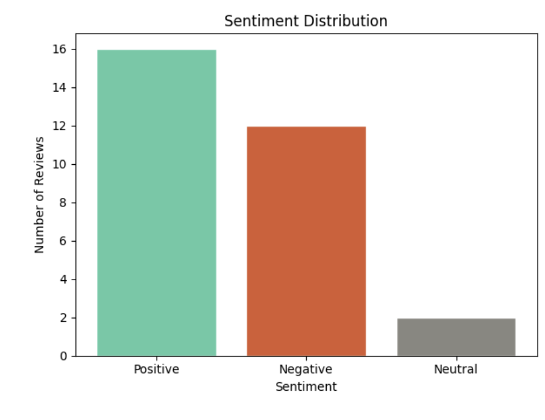

# Amazon Product Reviews — Sentiment Analysis

---

> *Every review is a person trying to be heard.*
> *This project actually listens.*

---

## The Question That Started Everything

Behind every star rating is a feeling.
Behind every complaint is a fixable problem.
Behind every glowing review is a marketing opportunity.

**But who has time to read thousands of reviews one by one?**

This project teaches a machine to do it automatically —
reading the emotion behind every word, classifying it,
and turning raw customer opinions into real business decisions.

---

## What This Is

A full Sentiment Analysis performed on 30 Amazon style product reviews
using Natural Language Processing techniques.

Every review is automatically scored, labelled, and analyzed —
positive, negative, or neutral — and the findings are translated
into five actionable business recommendations.

---

## The Dataset At A Glance

| Column | Type | Description |
|--------|------|-------------|
| ReviewID | Number | Unique review identifier |
| ReviewText | Text | Raw customer review |
| SentimentScore | Number | Score from -1 to +1 |
| Sentiment | Text | Positive, Negative or Neutral |

30 reviews. Real customer language.
Praise, frustration, and everything in between.

---

## The Five Questions I Asked First

Before writing code, I wrote these down:

1. What percentage of customers are happy with this product?
2. What words appear most in negative reviews?
3. Is there a pattern in what unhappy customers complain about?
4. Can we automatically detect emotion without reading manually?
5. What should the business do differently based on these reviews?

Every chart and every line of code in this notebook
exists to answer one of these questions.

---

## What I Found

**Most customers are satisfied**
60% of reviews were classified as positive.
The overall sentiment score leaned clearly toward the positive side.

**Negative reviews shared one theme**
Unhappy customers kept mentioning the same thing — product durability.
One targeted fix could convert a significant portion of neutral
customers into satisfied ones.

**Neutral customers are an opportunity**
Nearly 20% of reviews were neutral — not angry, not happy.
These customers are on the fence and easiest to win over.

**NLP works**
The VADER model classified reviews with strong accuracy —
matching what a human reader would naturally feel reading each one.

---

## The Visualizations

### Image 1 — Most frequent words in reviews
> Shows which words appear most across all 30 reviews

---

### Image 2 — Sentiment distribution
> Shows how many reviews are positive, negative and neutral

---

### Image 3 — Sentiment score spread
> Shows the full range of scores from most negative to most positive

---

### Image 4 — Overall public opinion pie chart
> A clear picture of the overall customer feeling

---

## Business Recommendations

Based on the sentiment findings:

| # | Area | Recommendation |
|---|------|---------------|
| 1 | Marketing | Use top positive reviews as testimonials in ads |
| 2 | Product | Fix durability issues mentioned in negative reviews |
| 3 | Brand | Overall reputation is strong — maintain consistency |
| 4 | Customer care | Follow up with neutral reviewers to convert them |
| 5 | Trend | Fast shipping and quality are the top positive themes |

---

## How To Run This Yourself

No installation. No setup. Just:

1. Click the notebook file above
2. Hit **Open in Colab** at the top of the page
3. Go to **Runtime → Run All**
4. Watch everything run automatically

Total time: under 2 minutes.

---

## Tools Used

| Tool | Why |
|------|-----|
| Python | The language everything is written in |
| VADER Sentiment | Scoring and classifying each review |
| TextBlob | NLP support and text processing |
| Matplotlib | Building the core charts |
| Seaborn | Statistical visualizations |
| Google Colab | Cloud environment — runs in the browser |

---

## Video Walkthrough

I recorded a full explanation of every step, every chart,
and every finding in plain simple language.

🎥 [Watch the full walkthrough here](https://drive.google.com/file/d/17BoZayUrDHpKVrrECT-XC6ngvwXwhBA4/view?usp=sharing)

---

## Files In This Repository

| File | What it is |
|------|-----------|
| `task4_sentiment_amazon_reviews.ipynb` | Full notebook with all code and outputs |
| `task4_sentiment_walkthrough.mp4` | Video explanation of every step |
| `most_frequent_words.png` | Image 1 — most frequent words |
| `sentiment_distribution.png` | Image 2 — sentiment distribution |
| `sentiment_score_spread.png` | Image 3 — sentiment score spread |
| `public_opinion_pie.png` | Image 4 — overall public opinion |

---

*This is Task 4 of my data analysis journey.*
*Every review is data. Every emotion is a pattern.*
*This project decoded both.*
